---
## Front matter
lang: ru-RU
title: Bыполнениe лабораторной работы №2
subtitle: 

## i18n babel
babel-lang: russian
babel-otherlangs: english
  
## Formatting pdf
toc: false
toc-title: Содержание
slide_level: 2
aspectratio: 169
section-titles: true
theme: metropolis
header-includes:
 - \metroset{progressbar=frametitle,sectionpage=progressbar,numbering=fraction}
 - '\makeatletter'
 - '\beamer@ignorenonframefalse'
 - '\makeatother'
---

# Цель

Закрепить практические навыки устранения уязвимостей и защиты интеграционной платформы

# Задание

Провести анализ уязвимостей, устранить их и последствия 

# Уязвимый узел Bitrix

Эксплуатация данной уязвимости позволяет удаленному нарушителю записать произвольные файлы в систему с помощью отправки специально сформированных сетевых пакетов.

Сначала заведём карточку с описание уязвимости, ее индикаторами и рекомендациями по устранению.

# Уязвимый узел Bitrix

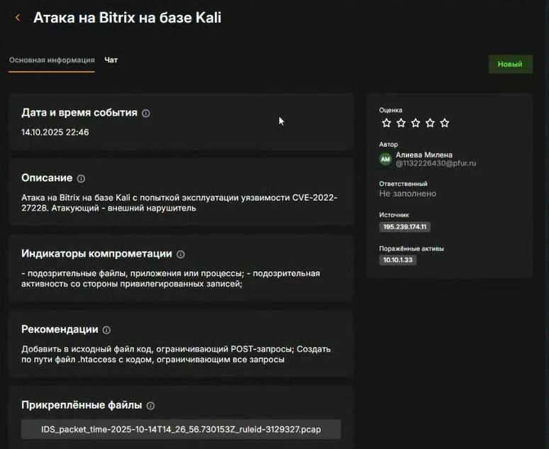{#fig:001 width=60%}

# Уязвимый узел Bitrix

Теперь начинаем устранять уязвимость. Для начала необходимо закрыть вектор для локального повышения привилегий, для этого удаляем SUID-бит у файла /var/www/html/apache_restart с помощью команды chmod –s /var/www/html/apache_restart и удаляем файл /var/www/html/apache_restart с помощью команды rm /var/www/html/apache_restart

# Уязвимый узел Bitrix

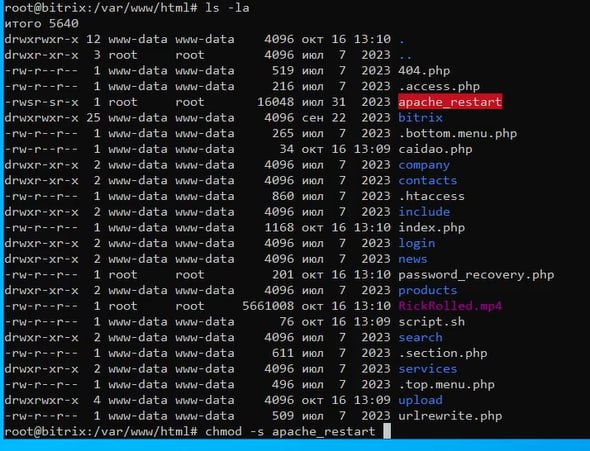{#fig:002 width=60%}

# Уязвимый узел Bitrix

После закрытия локального повышения привилегий можно приступить к закрытию уязвимости CVE-2022-27228 несколькими способами. Для этого мы создали файл .htaccess, который отклоняет все запросы к директории vote.

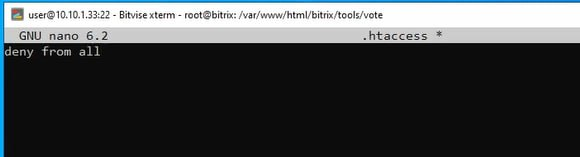{#fig:003 width=70%}

# Уязвимый узел Bitrix

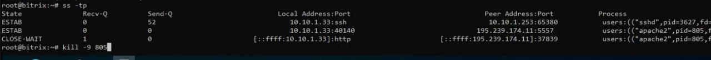{#fig:004 width=70%}

# Уязвимый узел Bitrix

Теперь уязвимость устранена:

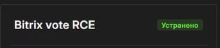{#fig:005 width=70%}

# Уязвимый узел Bitrix

Нейтрализуем полезную нагрузку. В нашем случае полезная нагрузка меняет пароль от учетной записи администратора, в связи с чем невозможно получить доступ к панели администрирования. Если подключиться на сервер Bitrix по протоколу SSH, то в директории веб-сервера можно обнаружить скрипт password_recovery.php. Нам необходимо поменять в нём пароль

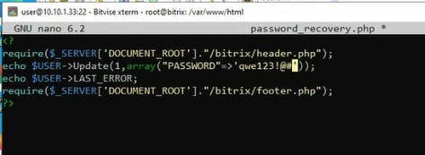{#fig:006 width=70%}

# Уязвимый узел Bitrix

Затем после восстановления доступа к панели администрирования можно приступить к восстановлению сайта после использования полезной нагрузки. В первую очередь удаляем все файлы в директории взломанного веб-сервера с помощью команды и файл резервной копии разархивируем в нужную директорию.

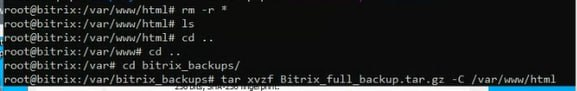{#fig:007 width=70%}

# Уязвимый узел Bitrix

Теперь последствие устранено:

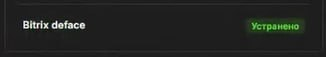{#fig:008 width=70%}

# Уязвимый узел Gitlab

Используемый на платформе сервер GitLab версии 13.10.2 содержит критическую уязвимость CVE-2021-22204, которая позволяет получить RCE при загрузке определенных файлов в репозиторий. Уязвимость заключается в том, что при загрузке файлов с расширением JPG, jpeg, tiff, модуль GitLab Workhorse передает файлы в библиотеку ExifTool, которая удаляет из них метаданные.

# Уязвимый узел Gitlab

Сначала заведём карточку с описание уязвимости, ее индикаторами и рекомендациями по устранению.

# Уязвимый узел Gitlab

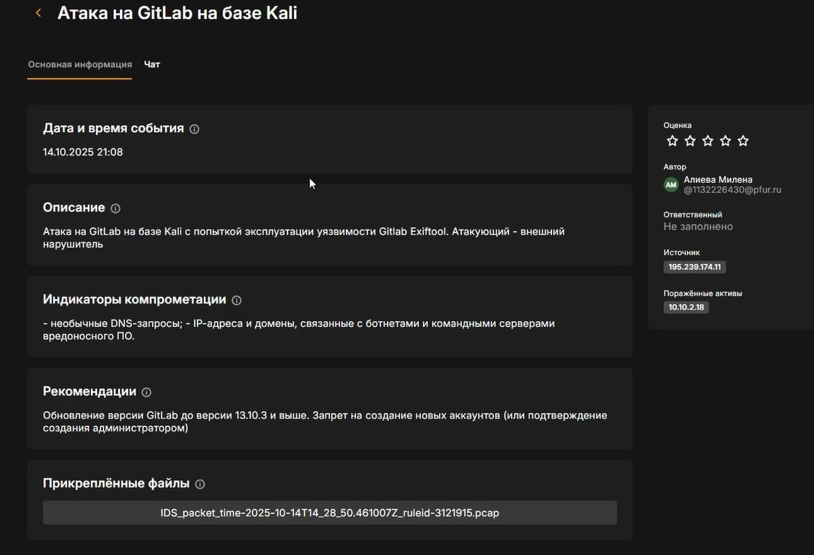{#fig:009 width=60%}

# Уязвимый узел Gitlab

Сначала изменим параметры регистрации новых пользователей, для этого перейдём на страницу авторизации Gitlab:

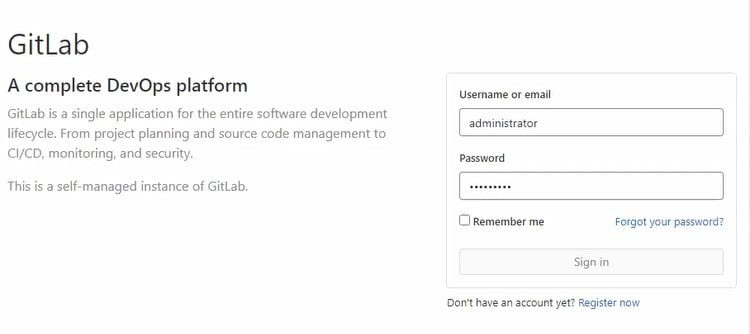{#fig:010 width=70%}

# Уязвимый узел Gitlab

Далее переходим в Admin Area и ищем пункт Sign-up restrictions, расширяем его, позволяем добавление новых пользователей только с одобрения администратора 

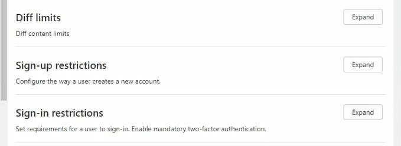{#fig:011 width=70%}

# Уязвимый узел Gitlab

После указанных действий нарушитель не сможет регистрировать новые учетные записи на сервере, но так как нарушитель уже проводил эксплуатацию ранее, то на сервере все еще существуют вредоносные учетные записи, их нужно удалить. В настройках переходим во вкладку Users, удаляем пользователя:

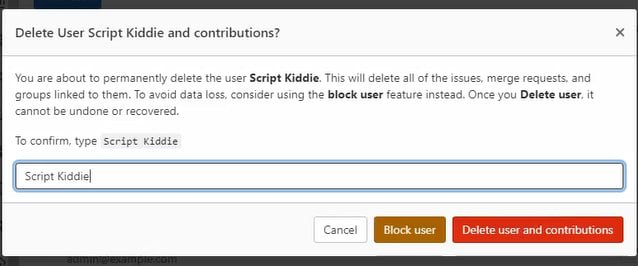{#fig:012 width=70%}

# Уязвимый узел Gitlab

Далее переходим к полезной нагрузке, в нашем случае это Meterpreter-сессия, её цель – получение нарушителем Meterpreter-сессии с уязвимым сервером. Для этого нам нужно обнаружить полезную нагрузку: 

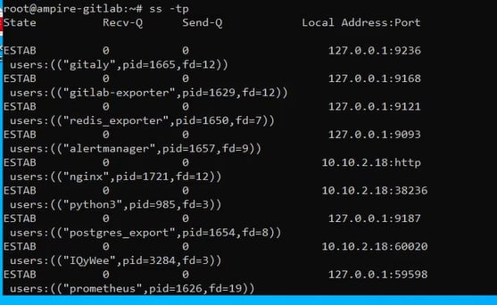{#fig:013 width=50%}

# Уязвимый узел Gitlab

И удалить её: 

{#fig:014 width=70%}

# Уязвимый узел Gitlab

Теперь закрыта уязвимость:

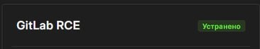{#fig:015 width=70%}

# Уязвимый узел Gitlab

Также закрыто и последствие:

{#fig:016 width=50%}

# Уязвимый узел API-Manager

Уязвимость платформы для интеграции интерфейсов прикладного программирования, приложений и веб-служб WSO2 связана с возможностью загрузки произвольного JSP-файла на сервер. Эксплуатация уязвимости может позволить нарушителю, действующему удаленно, выполнить произвольный код.

# Уязвимый узел API-Manager

Сначала заведём карточку с описание уязвимости, ее индикаторами и рекомендациями по устранению.
 
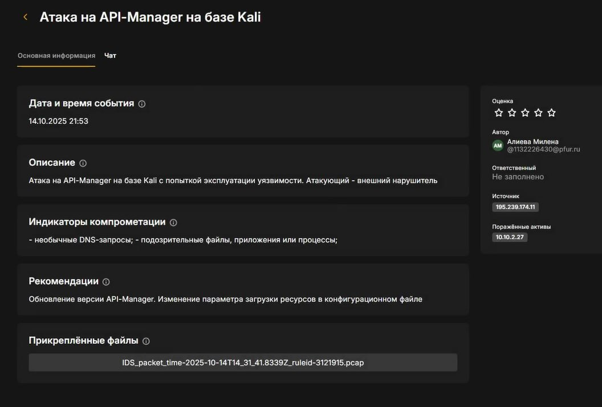{#fig:017 width=50%}

# Уязвимый узел API-Manager

Далее в нашем случае будем менять параметр загрузки ресурсов в конфигурационном файле. Для этого откроем файл конфигурации WSO2 API-Manager и добавим следующую запись:

# Уязвимый узел API-Manager

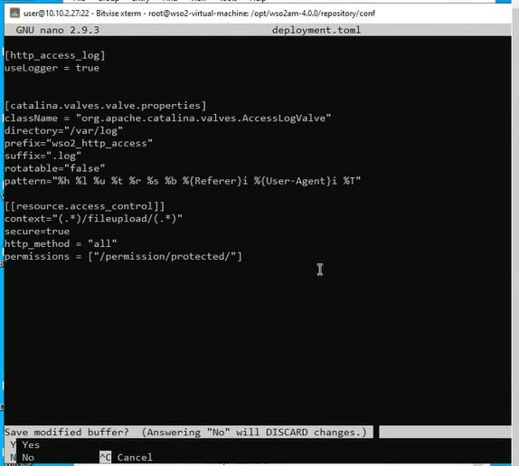{#fig:018 width=60%}

# Уязвимый узел API-Manager

Для вступления в силу внесенных изменений необходимо перезапустить службу с помощью команды:
systemctl restart wso2api.service 

# Уязвимый узел API-Manager

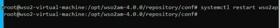{#fig:019 width=60%} 

# Уязвимый узел API-Manager

Также необходимо удалить загруженный exploit.jsp файл и сгенерированный файл payload.elf, так как наличие данных файлов на атакуемой машине позволит нарушителю получить сессию и после внесения изменений в конфигурационный файл

# Уязвимый узел API-Manager

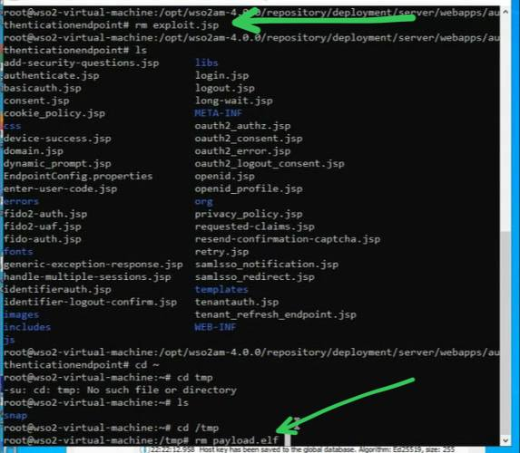{#fig:020 width=50%} 

# Уязвимый узел API-Manager

Теперь уязвимость устранена:

{#fig:021 width=70%} 

# Уязвимый узел API-Manager

Далее перейдём к полезной нагрузке. В нашем случае полезная нагрузка заключается в создании нарушителем пользователя в веб-интерфейсе WSO2 API-Manager. Для этого перейдём в веб-интерфейс WSO2 API-Manager

# Уязвимый узел API-Manager

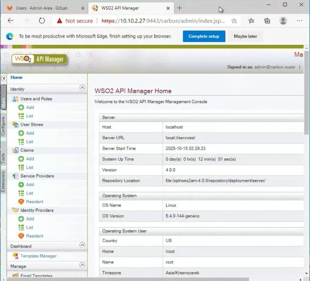{#fig:022 width=50%} 

# Уязвимый узел API-Manager

Для нейтрализации данной полезной нагрузки необходимо удалить созданного пользователя в веб-интерфейсе

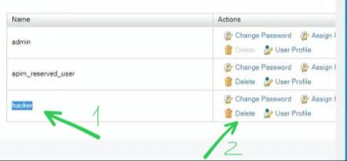{#fig:023 width=70%} 

# Уязвимый узел API-Manager

Теперь устранено последствие:

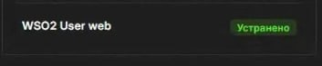{#fig:024 width=70%} 

# Выводы

В ходе выполнения лабораторной работы были выявлены и устранены уязвимости на различные узлы и их последствия, а также система была приведена в безопасное состояние
