---
## Front matter
title: "Отчёт по выполнению лабораторной работы №2"
author: " "

## Generic otions
lang: ru-RU
toc-title: "Содержание"

## Bibliography
bibliography: bib/cite.bib
csl: pandoc/csl/gost-r-7-0-5-2008-numeric.csl

## Pdf output format
toc: true # Table of contents
toc-depth: 2
lof: true # List of figures
lot: true # List of tables
fontsize: 12pt
linestretch: 1.5
papersize: a4
documentclass: scrreprt
## I18n polyglossia
polyglossia-lang:
  name: russian
  options:
  - spelling=modern
  - babelshorthands=true
polyglossia-otherlangs:
  name: english
## I18n babel
babel-lang: russian
babel-otherlangs: english
## Fonts
mainfont: PT Serif
romanfont: PT Serif
sansfont: PT Sans
monofont: PT Mono
mainfontoptions: Ligatures=TeX
romanfontoptions: Ligatures=TeX
sansfontoptions: Ligatures=TeX,Scale=MatchLowercase
monofontoptions: Scale=MatchLowercase,Scale=0.9
## Biblatex
biblatex: true
biblio-style: "gost-numeric"
biblatexoptions:
  - parentracker=true
  - backend=biber
  - hyperref=auto
  - language=auto
  - autolang=other*
  - citestyle=gost-numeric
## Pandoc-crossref LaTeX customization
figureTitle: "Рис."
tableTitle: "Таблица"
listingTitle: "Листинг"
lotTitle: "Список таблиц"
lolTitle: "Листинги"
## Misc options
indent: true
header-includes:
  - \usepackage{indentfirst}
  - \usepackage{float} # keep figures where there are in the text
  - \floatplacement{figure}{H} # keep figures where there are in the text
---

# Цель работы

Закрепить практические навыки устранения уязвимостей и защиты интеграционной платформы

# Задание

Провести анализ уязвимостей, устранить их и последствия 

# Выполнение 

## Уязвимый узел Bitrix

Эксплуатация данной уязвимости позволяет удаленному нарушителю записать произвольные файлы в систему с помощью отправки специально сформированных сетевых пакетов.

Сначала заведём карточку с описание уязвимости, ее индикаторами и рекомендациями по устранению.

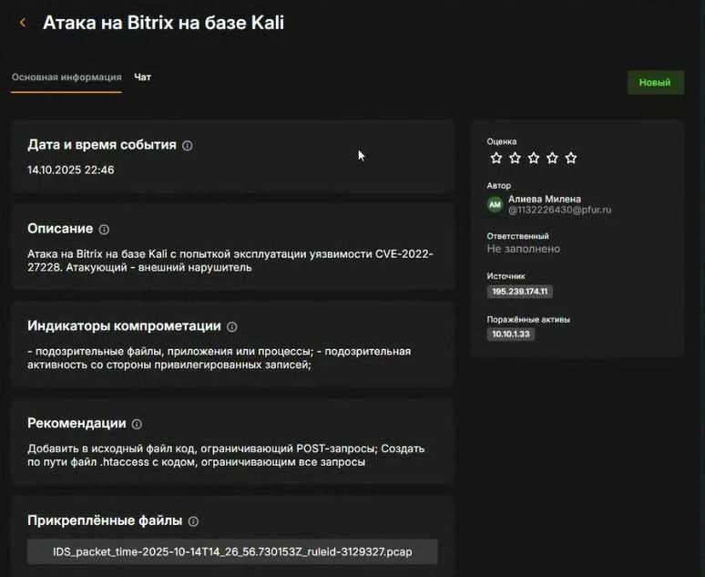{#fig:001 width=70%}

Теперь начинаем устранять уязвимость. Для начала необходимо закрыть вектор для локального повышения привилегий, для этого удаляем SUID-бит у файла /var/www/html/apache_restart с помощью команды chmod –s /var/www/html/apache_restart и удаляем файл /var/www/html/apache_restart с помощью команды rm /var/www/html/apache_restart

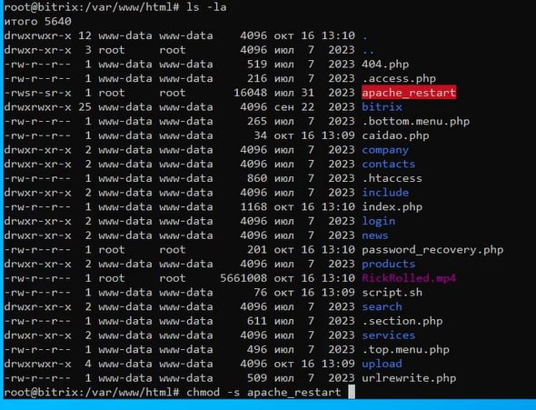{#fig:002 width=70%}

После закрытия локального повышения привилегий можно приступить к закрытию уязвимости CVE-2022-27228 несколькими способами. Для этого мы создали файл .htaccess, который отклоняет все запросы к директории vote.

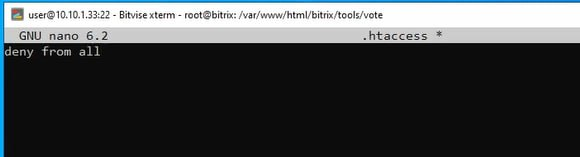{#fig:003 width=70%}

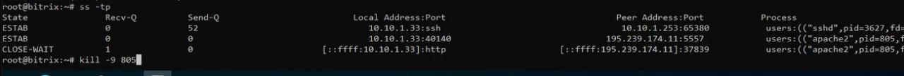{#fig:004 width=70%}

Теперь уязвимость устранена:

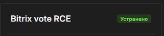{#fig:005 width=70%}

Затем нейтрализуем полезную нагрузку. В нашем случае полезная нагрузка меняет пароль от учетной записи администратора, в связи с чем невозможно получить доступ к панели администрирования. Если подключиться на сервер Bitrix по протоколу SSH, то в директории веб-сервера можно обнаружить скрипт password_recovery.php. Нам необходимо поменять в нём пароль

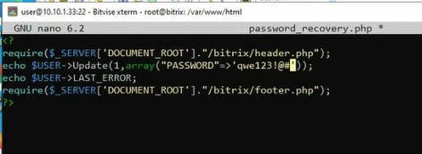{#fig:006 width=70%}

Затем после восстановления доступа к панели администрирования можно приступить к восстановлению сайта после использования полезной нагрузки. В первую очередь удаляем все файлы в директории взломанного веб-сервера с помощью команды и файл резервной копии разархивируем в нужную директорию.

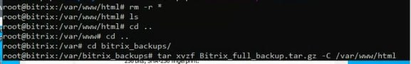{#fig:007 width=70%}

Теперь последствие устранено:

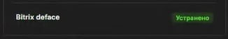{#fig:008 width=70%}

## Уязвимый узел Gitlab

Используемый на платформе сервер GitLab версии 13.10.2 содержит критическую уязвимость CVE-2021-22204, которая позволяет получить RCE при загрузке определенных файлов в репозиторий. Уязвимость заключается в том, что при загрузке файлов с расширением JPG, jpeg, tiff, модуль GitLab Workhorse передает файлы в библиотеку ExifTool, которая удаляет из них метаданные.

Сначала заведём карточку с описание уязвимости, ее индикаторами и рекомендациями по устранению.

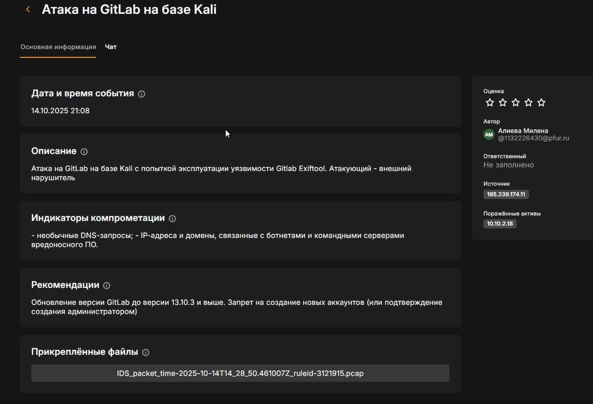{#fig:009 width=70%}

Сначала изменим параметры регистрации новых пользователей, для этого перейдём на страницу авторизации Gitlab:

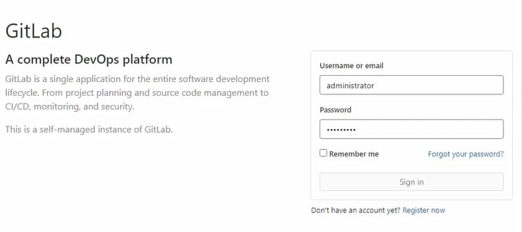{#fig:010 width=70%}

Далее переходим в Admin Area и ищем пункт Sign-up restrictions, расширяем его, позволяем добавление новых пользователей только с одобрения администратора 

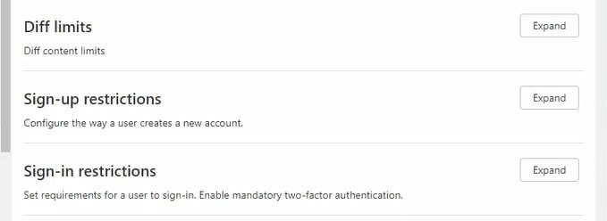{#fig:011 width=70%}

После указанных действий нарушитель не сможет регистрировать новые учетные записи на сервере, но так как нарушитель уже проводил эксплуатацию ранее, то на сервере все еще существуют вредоносные учетные записи, их нужно удалить. В настройках переходим во вкладку Users, удаляем пользователя:

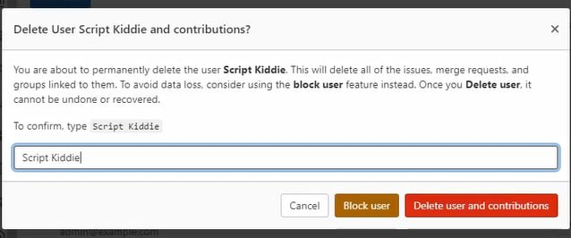{#fig:012 width=70%}

Далее переходим к полезной нагрузке, в нашем случае это Meterpreter-сессия, её цель – получение нарушителем Meterpreter-сессии с уязвимым сервером. Для этого нам нужно обнаружить полезную нагрузку: 

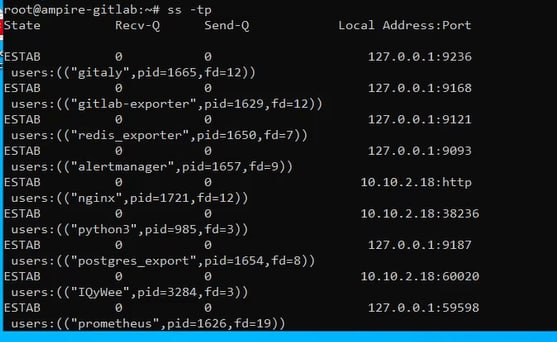{#fig:013 width=70%}

И удалить её: 

{#fig:014 width=70%}

Теперь закрыта уязвимость:

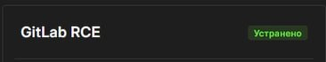{#fig:015 width=70%}

Также закрыто и последствие:

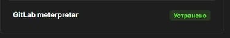{#fig:016 width=70%}

## Уязвимый узел API-Manager

Уязвимость платформы для интеграции интерфейсов прикладного программирования, приложений и веб-служб WSO2 связана с возможностью загрузки произвольного JSP-файла на сервер. Эксплуатация уязвимости может позволить нарушителю, действующему удаленно, выполнить произвольный код.

Сначала заведём карточку с описание уязвимости, ее индикаторами и рекомендациями по устранению.
 
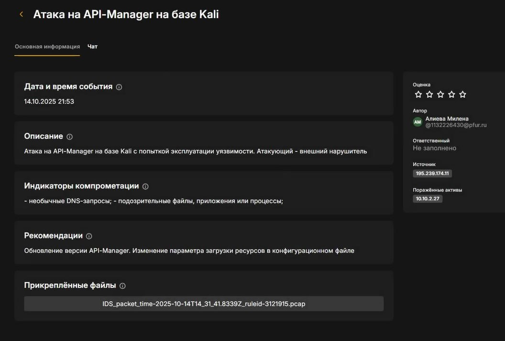{#fig:017 width=70%}

Далее в нашем случае будем менять параметр загрузки ресурсов в конфигурационном файле. Для этого откроем файл конфигурации WSO2 API-Manager и добавим следующую запись:

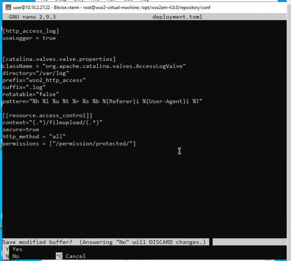{#fig:018 width=70%}

Для вступления в силу внесенных изменений необходимо перезапустить службу с помощью команды:
systemctl restart wso2api.service 

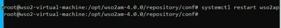{#fig:019 width=70%} 

Также необходимо удалить загруженный exploit.jsp файл и сгенерированный файл payload.elf, так как наличие данных файлов на атакуемой машине позволит нарушителю получить сессию и после внесения изменений в конфигурационный файл

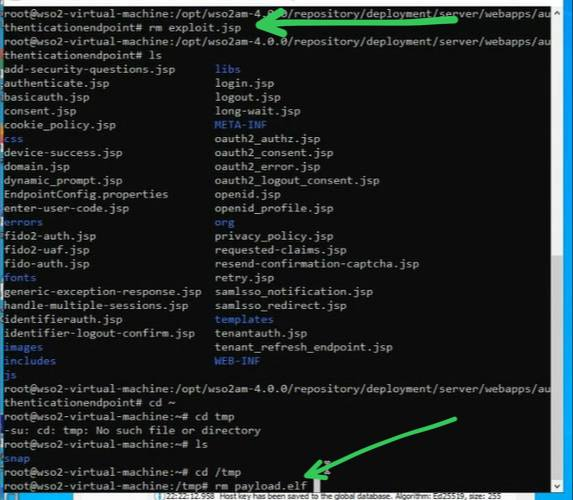{#fig:020 width=70%} 

Теперь уязвимость устранена:

{#fig:021 width=70%} 

Далее перейдём к полезной нагрузке. В нашем случае полезная нагрузка заключается в создании нарушителем пользователя в веб-интерфейсе WSO2 API-Manager. Для этого перейдём в веб-интерфейс WSO2 API-Manager

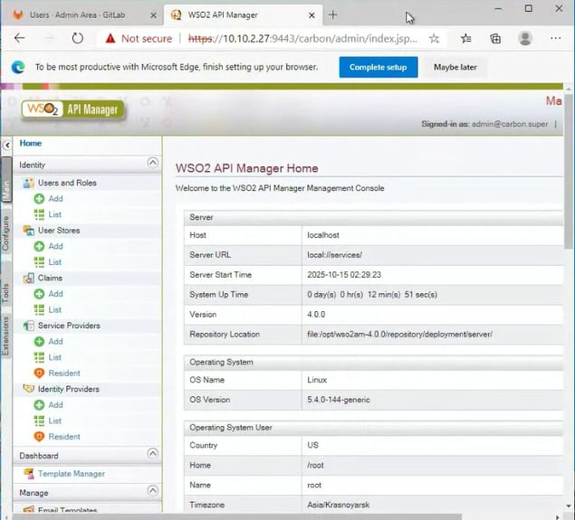{#fig:022 width=70%} 

Для нейтрализации данной полезной нагрузки необходимо удалить созданного пользователя в веб-интерфейсе

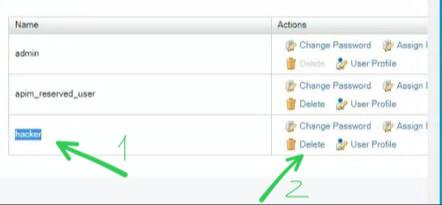{#fig:023 width=70%} 

Теперь устранено последствие:

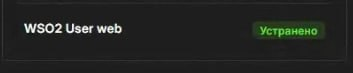{#fig:024 width=70%} 

# Выводы

В ходе выполнения лабораторной работы были выявлены и устранены уязвимости на различные узлы и их последствия, а также система была приведена в безопасное состояние.

