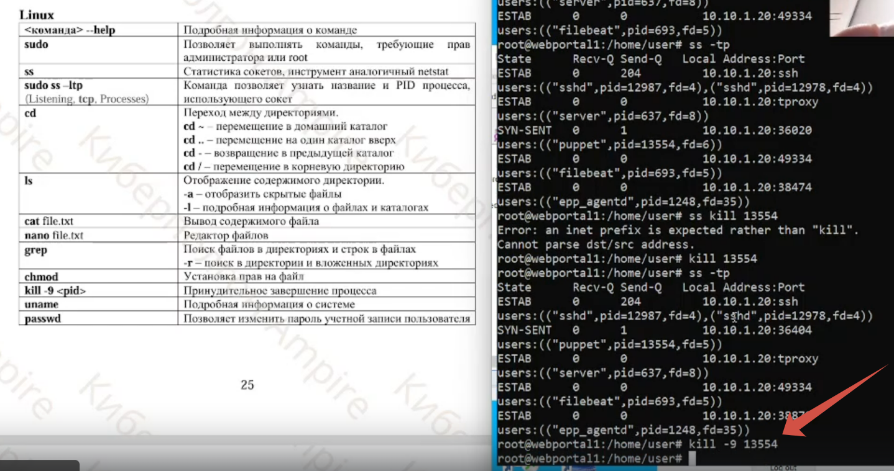
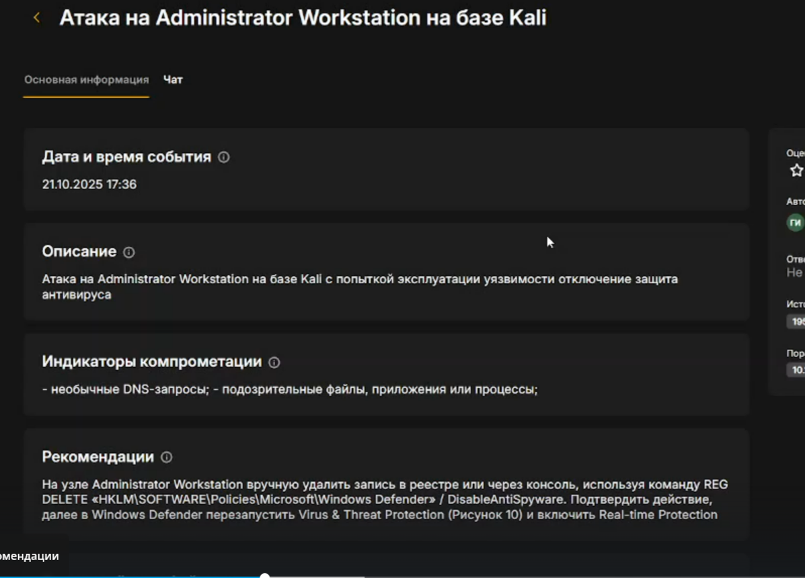
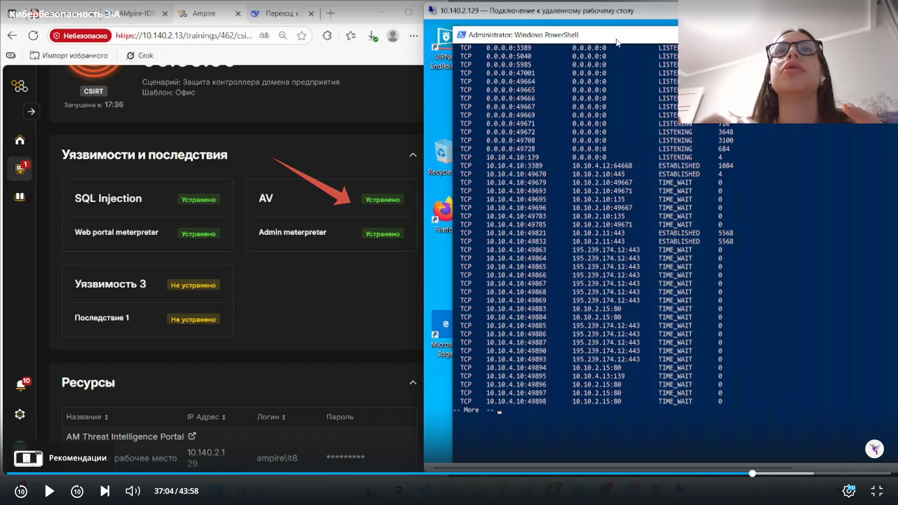
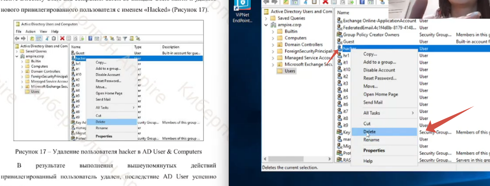
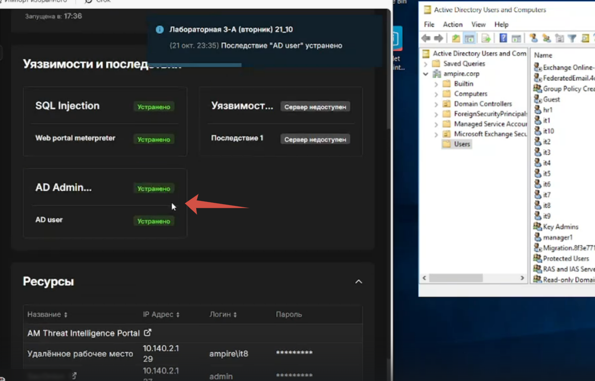

---
## Front matter
title: "Отчёт по лабораторной работе"
subtitle: "Кибербезопасность 3-A"
author: "група 1е"

## Generic otions
lang: ru-RU
toc-title: "Содержание"

## Bibliography
bibliography: bib/cite.bib
csl: pandoc/csl/gost-r-7-0-5-2008-numeric.csl

## Pdf output format
toc: true
toc-depth: 2
lof: true
lot: true
fontsize: 12pt
linestretch: 1.5
papersize: a4
documentclass: scrreprt

## I18n polyglossia
polyglossia-lang:
  name: russian
  options:
   - spelling=modern
   - babelshorthands=true
polyglossia-otherlangs:
  name: english

## I18n babel
babel-lang: russian
babel-otherlangs: english

## Fonts
mainfont: PT Serif
romanfont: PT Serif
sansfont: PT Sans
monofont: PT Mono
mainfontoptions: Ligatures=TeX
romanfontoptions: Ligatures=TeX
sansfontoptions: Ligatures=TeX,Scale=MatchLowercase
monofontoptions: Scale=MatchLowercase,Scale=0.9

## Biblatex
biblatex: true
biblio-style: "gost-numeric"
biblatexoptions:
  - parentracker=true
  - backend=biber
  - hyperref=auto
  - language=auto
  - autolang=other*
  - citestyle=gost-numeric

## Pandoc-crossref LaTeX customization
figureTitle: "Рис."
tableTitle: "Таблица"
listingTitle: "Листинг"
lofTitle: "Список иллюстраций"
lotTitle: "Список таблиц"
lolTitle: "Листинги"

## Misc options
indent: true
header-includes:
  - \usepackage{indentfirst}
  - \usepackage{float}
  - \floatplacement{figure}{H}
---

# Цель работы

Закрепить практические навыки обнаружения уязвимостей, детектирования инцидентов и восстановления безопасного состояния корпоративных сервисов в рамках сценария «Защита контроллера домена предприятия».

# Задание

Провести анализ событий, выявить уязвимости и последствия атак, а также устранить их, используя средства мониторинга и реагирования, предусмотренные в учебном комплексе Ampire.

# Выполнение лабораторной работы

## Уязвимость № 1 — SQL-инъекция (Web Server PHP)

SQL-инъекция позволяла выполнять произвольные запросы к базе данных и загружать вредоносные файлы. Нарушитель использовал параметр id в URL-запросах.

{ #fig:001 width=70% }  

Добавляем проверку типа параметра $id

{ #fig:002 width=70% } 

Готово)

{ #fig:003 width=70% } 

Далее нужно устранить последствие. Проверяем сокеты уязвимой машины

{ #fig:004 width=70% } 

Завершаем сессию с нарушителем

{ #fig:005 width=70% }  

Готово 

{ #fig:006 width=70% }  

## Уязвимость № 2 — отключённая защита антивируса (Administrator Workstation

На узле администратора выключена защита в реальном времени
Windows Defender, что дает нарушителю возможность получить контроль над
компьютером администратора при запуске им вредоносного скрипта

{ #fig:009 width=70% }  

Удаляем запись 

{ #fig:010 width=70% } 

И поскольку установленной сессии с нарушителем не обнарудилось, у нас устранились и уязвимость и последствие
Готово 

{ #fig:011 width=70% }  

## Уязвимость № 3 — слабый пароль учётной записи (MS Active Directory)

На узле MS Active Directory установлен слабый пароль к учетной записи
администратора, что позволяет нарушителю перебирать пароль

{ #fig:012 width=70% }  

Меняем пароль к учетной записи администратора на более сложный, не содержащийся в словарях

{ #fig:013 width=70% }  

Добавление нового привилегированного пользователя можно отследить
с помощью аудита событий входа в учетную запись Windows security. 
Удаляем пользователя с именем "Hacker"

{ #fig:014 width=70% }  

Уязвимость и последствие успешно устранены!

{ #fig:015 width=70% }  

# Выводы

В ходе лабораторной работы были:

- обнаружены и устранены уязвимости: SQL-инъекция, отключённая защита антивируса, слабый пароль администратора;
- ликвидированы последствия атак (веб-шелл, meterpreter-сессии, несанкционированные пользователи);
- восстановлена безопасность всех узлов системы;
- применены средства анализа и детектирования — ViPNet IDS NS, TIAS и Security Onion.

Система приведена в безопасное состояние.

# Список литературы{.unnumbered}

::: {#refs}
:::
